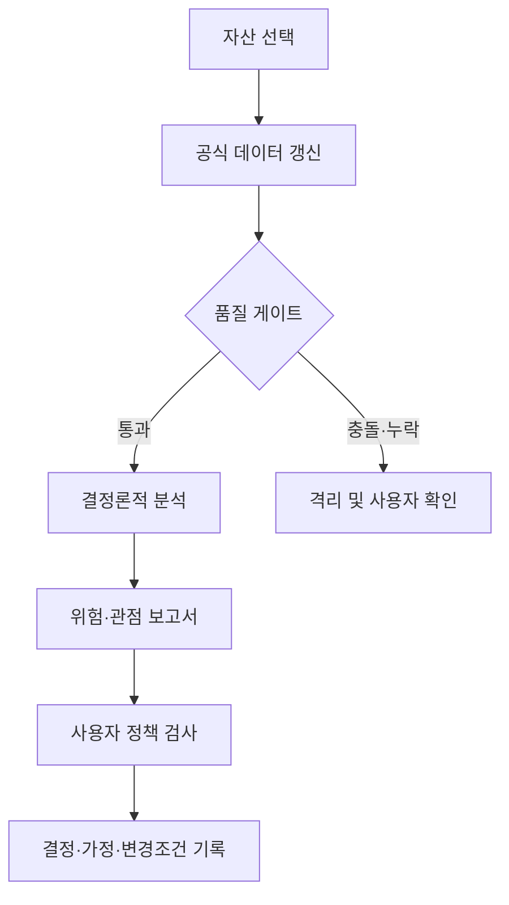

# 투자 의사결정 데이터베이스 PRD

| 항목 | 내용 |
|---|---|
| 문서 상태 | Draft v0.1 — 구현 기준선 |
| 작성일 | 2026-08-21 |
| 제품 대상 | 개인 투자자이자 개발자인 단일 사용자 |
| 1차 시장 | 한국·미국 상장주식 및 ETF |
| 분석 주기 | 일 단위(EOD), 사용자 요청 시 갱신 |
| 투자 관점 | 중장기, 기본적 분석 중심, 시장상태·위험 보조 |
| 제품 성격 | 투자 의사결정 지원 및 기록, 투자자문 아님 |

## 1. 제품 한 문장

공식 원천에서 확인 가능한 사실과 재현 가능한 계산을 바탕으로 자산을 여러 관점에서 보여주고, 사용자가 위험·불확실성·판단 변경 조건을 인식하고 관리하도록 돕는다.

## 2. 문제 정의

개인 투자자는 수익 가능성에 관한 정보는 쉽게 접하지만, 다음 질문에 일관되게 답하기 어렵다.

- 이 숫자는 어디서 왔고 지금도 유효한가?
- 같은 데이터가 충돌할 때 무엇을 믿어야 하는가?
- 잠재 수익이 아니라 내가 감수하는 손실·변동성·집중 위험은 무엇인가?
- 사실, 계산, 해석, 가정은 서로 분리되어 있는가?
- 내 판단을 바꿔야 할 조건은 무엇인가?
- 당시 알 수 있었던 정보만으로 판단했는가?

현재 시장 정보는 수익 서사와 단일 점수에 치우치기 쉽다. 본 제품은 그 반대편에서 데이터 상태와 위험을 먼저 드러내는 것을 핵심 가치로 삼는다.

## 3. 목표와 비목표

### 목표

- 공식 원천의 데이터만으로 개인용 분석 기반을 만든다.
- 각 값의 출처, 수집시각, 원본, 수정 이력을 추적할 수 있게 한다.
- 자산별 수익률보다 먼저 변동성·낙폭·하방위험·유동성·집중 위험을 보여준다.
- 계산 결과와 AI 해석을 명확히 분리한다.
- 사용자 투자정책에 어긋나는 조건을 투명한 게이트로 표시한다.
- 결론 대신 찬성 논거, 반대 논거, 데이터 한계, 판단 변경 조건을 제공한다.
- 동일 입력과 동일 버전에서 동일 결과를 재현한다.

### 비목표

- 종합 매수점수, 매수·매도 신호, 목표주가 제공
- 수익률 극대화 또는 시장수익률 초과 보장
- 실시간 호가, 초단타, 자동 주문, 옵션 전략
- 애널리스트 컨센서스와 유료 뉴스 원문 재배포
- 소셜미디어 감성을 직접 매매 신호로 변환
- 웹 크롤링, 비공식 API, 비공식 데이터 라이브러리 사용
- 초기 버전의 다중 사용자·상업 서비스 운영

## 4. 제품 원칙

1. **Risk before return** — 기대수익을 말하기 전에 손실 경로와 불확실성을 보여준다.
2. **Evidence before interpretation** — 사실과 계산이 해석보다 앞선다.
3. **Official sources only** — 자동 수집은 공식 API·공식 벌크·명시적 공식 다운로드로 제한한다.
4. **Code for numbers, AI for documents** — 재현 가능한 숫자는 코드, 비정형 의미는 AI가 처리한다.
5. **No hidden score** — 서로 다른 위험을 불투명한 하나의 점수로 압축하지 않는다.
6. **Conflict is information** — 공급원 충돌은 평균내지 않고 원인을 찾을 때까지 격리한다.
7. **Point-in-time first** — 판단 시점에 공개된 정보만 사용하도록 발표·접수·수집·수정 시각을 보존한다.
8. **User owns the decision** — 시스템은 판단을 구조화하고 최종 결정은 사용자가 기록한다.

## 5. 사용자와 핵심 작업

### 주 사용자

시장과 소프트웨어를 이해하지만, 기관급 데이터 비용이나 운영 인력 없이 자신의 중장기 투자 판단을 더 객관적으로 만들고 싶은 개인 개발자다.

### Jobs to be Done

- 관심 자산을 검토할 때 데이터가 신뢰 가능한지 먼저 확인하고 싶다.
- 자산의 재무·시장·이벤트·포트폴리오 관점을 한 보고서에서 비교하고 싶다.
- 내가 허용한 손실·집중·유동성 한도를 넘는지 알고 싶다.
- 결정을 내린 시점의 근거와 반대 논리를 남기고 나중에 판단 품질을 복기하고 싶다.

## 6. 핵심 사용자 흐름

## 7. MVP 범위

### 7.1 Phase 0 — Data Spike

표본 20개(한국 주식 5, 한국 ETF 5, 미국 주식 5, 미국 ETF 5)에 대해 다음을 검증한다.

- 자산 식별자 매핑
- 5년 일별 가격과 기업행동
- 최근 재무제표와 주요 공시 링크
- 원본 스냅샷과 데이터 계보
- 주 원천과 검증 원천의 표본 비교
- 충돌·결측·호출제한·스키마 변경 대응
- 공급원·수집 실행·원본 계보·canonical 자산을 확인하는 로컬 읽기 전용 웹 대시보드

### 7.2 Phase 1 — Risk & Deterministic Analytics

- 단일 자산: 기간수익률, 연환산 변동성, 하방편차, 최대낙폭, 현재낙폭, 회복기간, Historical VaR
- 포트폴리오: 자산·국가·통화·업종·기업 집중도, 상관관계, 위험기여도, ETF 중복
- 기본적 분석: 성장·수익성·재무안정성·현금흐름·상대가치
- 기술적 분석: 추세·변동성·유동성·과열 상태의 설명만 제공
- ETF 분석: 비용·추적차이·유동성·집중·복제 방식

세부 항목과 공식은 투자자산운용사 자격증 체계를 도메인 분류표로 만든 뒤 확정한다. 현재 목록은 확장 방향이지 최종 투자 규칙이 아니다.

### 7.3 Phase 2 — AI Document Analysis

- 공시·IR·API로 발견한 뉴스 메타데이터의 문서 유형·기업·사건·시점 추출
- 주장과 근거, 영향 경로, 기간, 반대 논리, 불확실성 구조화
- 공식 공시의 변경점 비교
- 근거 URL·근거 구간·모델·프롬프트 버전 기록

AI는 숫자를 재계산하거나 가격·목표가·매매 결론을 생성하지 않는다.

### 7.4 Phase 3 — Decision Journal

- 투자 목적, 보유기간, 허용위험, 진입 가정 입력
- 데이터·정책 게이트 결과 확인
- 긍정/반대 논거와 판단 변경 조건 기록
- 사용자 override와 이유 기록
- 사후 수익과 당시 판단 품질을 별도로 회고

## 8. 데이터 공급 정책

### 허용

- 규제기관·거래소·중앙은행·정부의 공식 API와 벌크 파일
- 문서화된 데이터 공급자 공식 API
- 발행사·운용사가 다운로드 용도로 명시적으로 제공하는 CSV/XLS/XML/JSON/PDF
- 공식 RSS 또는 공식 개발자 API가 반환한 뉴스 메타데이터

### 금지

- 일반 웹페이지 HTML 크롤링·스크래핑
- 비공식·역공학 API
- `yfinance`, `pykrx`, `FinanceDataReader` 등 비공식 수집 라이브러리
- 로그인·유료벽·CAPTCHA·rate limit 우회
- 브라우저 자동화로 API 제한을 회피하는 수집

검증 URL은 사용자에게 보여주기 위한 링크이며 시스템이 해당 페이지를 크롤링하지 않는다.

### 기본 공급원

| 영역 | Primary | Validation/Fallback | 사용자 확인 |
|---|---|---|---|
| 한국 가격·ETF | KRX Open API | KIS Open API 표본 | KRX 공식 화면 링크 |
| 한국 공시·재무 | OpenDART | 공시 원문 | DART 원문 링크 |
| 미국 가격·ETF | Tiingo EOD | Twelve Data·KIS·Alpha Vantage 표본 | 공급자·Nasdaq 공식 링크 |
| 미국 공시·재무 | SEC EDGAR | 기업 IR 공식 문서 | SEC 원문 링크 |
| 한국 거시 | ECOS·KOSIS | 원 생산기관 | 공식 통계 링크 |
| 미국 거시 | FRED/ALFRED·BLS | 원 생산기관 | 공식 시계열 링크 |
| 뉴스 발견 | NAVER News API·GDELT API | 기업 IR·공식 보도자료 | 원 기사·공시 링크 |
| ETF 보유 | KRX 공식 파일·운용사 공식 다운로드 | SEC N-PORT | 상품·공시 링크 |

## 9. 기능 요구사항

| ID | 요구사항 | MVP 수용 기준 |
|---|---|---|
| DATA-001 | 공급원 등록 | 권위, 역할, 접근방식, 약관, 확인 URL, 활성 상태를 코드 밖 설정으로 표현한다. |
| DATA-002 | 공식 원천 강제 | 비공식 권위 또는 `scraping` 방식은 등록 단계에서 실패한다. |
| DATA-003 | 원본 보존 | 응답 바이트, 요청 URL, 수집시각, HTTP 상태, SHA-256을 변경 불가능한 스냅샷으로 저장한다. |
| DATA-004 | 시간 모델 | `period`, `effective`, `published`, `filed`, `fetched`, `revised`, `valid` 시점을 구분할 수 있다. |
| DATA-005 | 식별자 매핑 | 내부 `asset_id`에 ticker, ISIN, CIK, DART corp code, 거래소 코드를 연결한다. |
| DATA-006 | 품질 검사 | 가격 관계·음수·중복·날짜 순서·공급원 차이를 검사한다. |
| DATA-007 | 충돌 격리 | 임계치 밖의 가격 충돌은 평균하지 않고 `quarantined`와 원인을 기록한다. |
| DATA-008 | 최신성 표시 | 마지막 성공시각과 stale 상태를 사용자에게 표시한다. |
| CALC-001 | 재현 가능한 계산 | 계산 버전, 입력 해시, 파라미터가 같으면 결과가 같다. |
| RISK-001 | 단일 자산 위험 | 수익률·변동성·하방편차·낙폭·회복·Historical VaR를 제공한다. |
| RISK-002 | 사용자 정책 | 사용자가 입력한 한도만 위반 여부를 검사하며 숨은 기본 가중치를 사용하지 않는다. |
| RISK-003 | 한계 노출 | 표본 부족, 불규칙 빈도, 기업행동 미반영 가능성을 결과에 표시한다. |
| VIEW-001 | 다관점 보고서 | 사실, 기본, 위험, 시장상태, 사건, 반대논리, 누락, 변경조건을 분리한다. |
| VIEW-002 | 데이터 상태 대시보드 | 로컬 웹 화면에서 공급원, 수집 성공·실패, raw snapshot 계보, 자산 식별자와 데이터 건수를 읽기 전용으로 확인한다. |
| AI-001 | 문서 구조화 | 허용된 문서에서 사건·주장·근거·불확실성을 JSON schema로 추출한다. |
| AI-002 | 근거 강제 | URL과 근거 구간이 없으면 사실 주장을 확정하지 않는다. |
| DEC-001 | 결론 통제 | API와 UI는 매수·매도 점수 또는 추천 문구를 반환하지 않는다. |
| DEC-002 | 결정 기록 | 사용자 결정·가정·override·검토일·변경조건을 기록한다. |

## 10. 결과 보고서 계약

최종 사용자 보고서는 다음 순서를 따른다.

1. 분석 기준시각, 데이터 최신성, 충돌·누락 상태
2. 투자 목적과 보유기간
3. 확인된 사실과 원천
4. 기본적 분석
5. 가치평가 시나리오와 가정 민감도
6. 위험과 기존 포트폴리오에 미치는 영향
7. 기술적 시장 상태
8. 공시·뉴스 사건
9. 가장 강한 반대 논리
10. 데이터 한계와 미확인 항목
11. 판단 변경 조건
12. 사용자 결정과 근거

시스템 상태는 `검토 가능`, `추가 데이터 필요`, `투자정책 위반`, `가정 민감도 높음`, `데이터 충돌로 판단 보류`, `사용자 결정 기록 완료`처럼 표현한다.

## 11. 비기능 요구사항

- 재현성: 같은 입력·계산 버전의 결과 일치율 100%
- 계보: 파생 지표의 원 입력과 스냅샷 해시 연결률 100%
- 품질: 설명되지 않은 가격 이상치는 canonical store에 진입하지 않음
- 장애대응: 마지막 정상 snapshot 유지, stale 표시, 제한된 재시도와 provider별 rate limit
- 보안: 키는 환경변수/secret에 저장하고 로그·URL·원본 메타데이터에서 마스킹
- 개인정보: 계좌번호·보유수량은 필요 없는 AI 요청에 포함하지 않음
- 테스트: 네트워크 없이 계산·정책·커넥터 계약을 검증
- 호환성: WSL2 Ubuntu 24.04, Python 3.12/3.13, Docker Compose

## 12. 성공 지표

수익률이 아니라 판단 품질을 측정한다.

| 지표 | 목표 |
|---|---:|
| 표본 자산 기대 일별 레코드 수집률 | 95% 이상 |
| 파생 결과의 lineage 연결률 | 100% |
| 미설명 이상치의 격리/설명률 | 100% |
| 동일 입력 결과 재현률 | 100% |
| 사용자 보고서의 출처 링크 포함률 | 100% |
| 정책 위반과 override 이유 기록률 | 100% |
| AI 사건 샘플의 수동 검토 커버리지 | 초기 100% |

## 13. 주요 위험과 대응

| 위험 | 대응 |
|---|---|
| 무료 플랜·약관 변경 | Source Registry에 권한·약관 URL·검토일을 기록하고 상업화 전에 전면 재검토 |
| 서로 다른 종가 정의 | 원가격/수정가격·세션·시간대를 분리하고 충돌값 격리 |
| 수정공시가 과거를 덮음 | 새 버전으로 추가하고 `published_at` 기준 point-in-time 조회 |
| 규칙 과최적화 | 자격 체계 근거, 사전 정의, walk-forward, 시도 횟수 기록 |
| AI의 근거 없는 해석 | schema·근거 구간·unknown·회귀 평가 강제 |
| 복잡성 급증 | 20개 Data Spike 후에만 엔진·자산군 확대 |
| 위험 지표의 오해 | 계산식·기간·표본수·기업행동 조정 여부를 함께 표시 |

## 14. 릴리스 계획

| 단계 | 결과물 | 종료 조건 |
|---|---|---|
| v0.1 기반 | 소스 정책, raw snapshot, SEC 커넥터, 단일자산 위험 API/CLI | 자동 테스트와 예제 실행 성공 |
| v0.2 Data Spike | 6개 핵심 커넥터, 20개 표본, PostgreSQL canonical store | 5년 데이터·재무·공시·lineage 검증 |
| v0.3 정량 분석 | 기본·위험·기술·ETF 분석 | 자격 체계 매핑과 공식 검증 완료 |
| v0.4 문서 AI | 사건 추출·근거·반대 논리 | 한국어/영어 평가셋과 회귀 기준 통과 |
| v0.5 결정 기록 | 조건부 보고서와 decision journal | override·변경조건·회고 흐름 완성 |

## 15. 확정이 필요한 질문

- 투자자산운용사 과목·장별 개념을 어떤 도메인 분류와 계산 규칙으로 매핑할 것인가?
- 첫 20개 표본 자산은 무엇이며 상장폐지·분할·고배당·저유동성 사례를 어떻게 포함할 것인가?
- 개인 투자정책의 기본 입력 항목과 단위는 무엇인가?
- 가격 데이터의 수정주가 기준과 총수익 계산 정책은 무엇인가?
