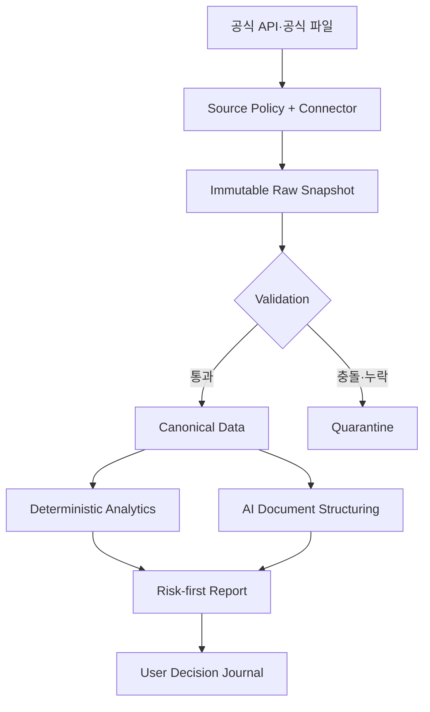

# 프로젝트 개요

## 1. 방향

이 프로젝트는 자산을 “살 것인가”로 압축하지 않는다. 공식 데이터의 상태, 재현 가능한 분석, 위험과 반대 논리를 나란히 보여주어 사용자가 더 나은 결정을 내리고 그 근거를 기록하게 한다.

개발 순서는 Personal OS의 `Research → Design → Build → Test → Document → Feedback → Improve`를 따른다. 이 저장소는 제품 코드와 프로젝트 문서의 Source of Truth이며, 조사 중 얻은 장기 지식과 개인적 통찰은 별도 지식 저장소에서 관리한다.

## 2. 현재 구현 범위

`v0.1 Data & Risk Foundation`의 첫 단계로 데이터 신뢰 경계와 수집 저장 기반을 구현 중이다.

| 영역 | 구현 상태 |
|---|---|
| 공식 원천 Source Registry | 구현 |
| 비공식·크롤링 소스 차단 정책 | 구현 |
| SEC EDGAR submissions 커넥터 | 구현 |
| 불변 raw JSON snapshot + SHA-256 | 구현 |
| 종가 입력 품질 검사 | 구현 |
| 공급원 차이 quarantine | 구현 |
| 단일 자산 위험 엔진 | 미구현 |
| 사용자 위험 한도 게이트 | 미구현 |
| SEC 수집 CLI | 구현 |
| FastAPI 읽기 전용 Data Console·종목 상세 | 구현 |
| PostgreSQL 핵심 스키마와 수집 adapter | 초기 구현 |
| KRX 종목·가격 실제 연결 | 구현 |
| OpenDART 공시목록 실제 연결 | 구현 |
| Tiingo 미국 가격·종목정보 연결 | 구현 |
| SEC·OpenDART 규제기관 식별자 매핑 | 구현 |
| 수집 실행 이력과 stale 상태 조회 | 구현 |
| 20개 Data Spike manifest·준비상태 점검 | 구현 |
| 기본·기술·ETF 분석 | 자격 체계 매핑 후 구현 |
| AI 문서 분석·Decision Journal | 후속 단계 |

## 3. 시스템 경계



현재 코드가 직접 실행하는 경로는 SEC 공시, KRX 종목·가격, OpenDART 공시목록과 Tiingo 미국 EOD 수집이다. SEC와 OpenDART의 공식 목록에서 기존 ticker에 CIK와 corp code를 정확 일치로 연결한다. 모든 응답은 raw snapshot으로 보존하고 PostgreSQL canonical 테이블 및 수집 실행에 계보를 연결한다. 가격 중 품질 검사를 통과하지 못한 행은 canonical에 넣지 않고 격리한다. FastAPI Data Console은 이 상태를 읽기 전용 HTML과 JSON API로 제공한다. 위험 계산과 AI 경로는 아직 구현하지 않았다.

## 4. 계층별 책임

| 계층 | 책임 | 하지 않는 일 |
|---|---|---|
| Source Policy | 자동 수집 가능한 원천·방식 검증 | 데이터의 투자 의미 판단 |
| Connector | 공식 API 호출, 제한·헤더·오류 처리 | 분석·값 보정 |
| Raw Store | 원본·URL·시각·해시 불변 보존 | 원본 덮어쓰기 |
| Quality | 형식·범위·중복·공급원 충돌 검사 | 충돌값 평균 |
| Canonical | 자산·단위·시점이 정규화된 사실 | 파생 지표를 원 사실로 취급 |
| Analytics | 버전된 공식으로 수치 계산 | 자연어 추측·매매 결론 |
| AI | 허용 문서의 사건·주장·근거 구조화 | 숫자 계산·목표가·매매 결정 |
| Policy Gate | 사용자 명시 한도와 결과 비교 | 숨은 가중치·범용 매수점수 |
| Decision Journal | 사용자 결정·override·변경조건 기록 | 사용자 책임 대체 |

## 5. 데이터 신뢰 모델

각 데이터셋은 같은 역할의 공급원을 무제한으로 늘리지 않고 다음 관계를 갖는다.

| 역할 | 의미 | 처리 |
|---|---|---|
| Primary | 실제 계산에 사용하는 주 원천 | 성공한 최신 검증 버전을 canonical로 승격 |
| Validation | 주 원천의 표본 오류 탐지 | 허용범위 안에서는 일치 기록, 밖이면 quarantine |
| Fallback | 주 원천 장애 시 제한된 임시 대체 | 출처와 fallback 상태를 명시 |
| Verification | 사용자가 직접 확인할 공식 URL | 링크만 제공하고 페이지를 크롤링하지 않음 |

원본, canonical, derived 결과를 구분한다.

- Raw: HTTP 응답/공식 파일, 요청 메타데이터, 수집시각, SHA-256
- Canonical: 내부 asset ID, 원 식별자, 통화, 단위, 경제적·공개 시점
- Derived: 계산 버전, 파라미터, 입력 해시를 가진 위험·재무·시장 지표

## 6. 계획된 리스크 엔진 v0.1

위험 계산 단계의 입력은 날짜 순으로 정렬된 양의 일별 종가로 계획한다. 엔진은 다음을 계산할 예정이다.

- 기간수익률
- 산술 일수익률 관측치 수
- 연환산 변동성: 표본표준편차 × `√252`
- 연환산 하방편차: 음의 수익률만 0 아래 편차로 계산 × `√252`
- 최대낙폭, 고점일, 저점일, 회복일, 회복 거래일 수
- 현재낙폭
- 95% Historical VaR: 일수익률 5% 분위수의 손실 크기
- 양의 수익률 일수 비중

엔진에는 “변동성 30%면 나쁨” 같은 숨은 기준을 넣지 않는다. 사용자가 한도를 명시했을 때만 통과·위반을 반환하고, 표본 및 기업행동 조정 여부의 한계를 별도 필드로 표시하는 계약은 구현 전에 PRD와 ADR에서 확정한다.

## 7. 소스 정책

자동 수집의 허용 방식은 `official_api`, `official_bulk`, `official_download`뿐이다. Source Registry의 모든 항목은 권위 주체, 데이터 역할, 문서 URL, 약관 URL, 확인 URL과 구현 상태를 가진다.

금지 방식은 코드와 테스트 양쪽에서 막는다.

- HTML scraping/crawling
- 비공식·역공학 API
- 웹 포털 세션·브라우저 자동화 기반 수집
- 비공식 데이터 SDK/라이브러리
- 공급자 차단·호출량 제한 우회

## 8. 저장소 구조

```text
Asset_Frame/
├── AGENTS.md
├── README.md
├── pyproject.toml
├── compose.yaml
├── db/init/001_core.sql
├── config/sources.toml
├── docs/
│   ├── dependency-sources.toml
│   └── adr/0001-data-ingestion-boundaries.md
├── src/asset_frame/
│   ├── connectors/
│   ├── dashboard/
│   ├── domain/
│   ├── ingestion/
│   ├── quality/
│   ├── sources/
│   ├── storage/
│   └── web/
└── tests/
```

## 9. 실행 구성

- Python 3.12/3.13와 `uv`
- PostgreSQL은 canonical 데이터와 lineage의 목표 저장소
- 로컬 raw 디렉터리는 API 응답 원본을 content hash 기반으로 보존
- 테스트는 fake transport를 사용해 외부 네트워크와 키가 없어도 실행
- FastAPI Data Console은 읽기 전용 dashboard repository를 통해 PostgreSQL 상태를 제공
- 정량 엔진은 후속 단계에서 현재 service 경계 위에 추가

### 로컬

```bash
uv sync --dev
uv run pytest
```

### Docker Compose

```bash
cp .env.example .env
docker compose up --build
```

PostgreSQL 초기화 시 Source Registry·수집 실행·Raw Snapshot·자산 식별자·가격·기업행동·재무사실·공시·ETF 보유·거시 시계열·Quality Issue 테이블이 생성된다. 현재 repository adapter는 공급원, 성공·실패 수집 실행, raw snapshot 계보, 자산 식별자, 공시, KRX·Tiingo 가격, Tiingo 기업행동과 격리 기록을 지원한다. `source-status`는 호출자가 지정한 허용 경과시간으로 마지막 성공 실행의 stale 여부를 계산한다.

## 10. 주요 기술 결정

| 결정 | 이유 | 기록 |
|---|---|---|
| 공식 원천만 허용 | 안정성·권한·검증 가능성 확보 | ADR-0001 |
| 리스크 우선, 종합점수 없음 | 허위 정밀도와 판단 위임 방지 | ADR-0002 |
| 숫자와 AI 책임 분리 | 재현성·감사 가능성·환각 통제 | ADR-0003 |
| 20개 Data Spike 우선 | 전체 범위 확장 전 데이터 함정 발견 | PRD 7.1 |
| PostgreSQL + 불변 raw | point-in-time·수정 이력·계보 보존 | 본 문서 5장 |
| Tiingo raw + CRSP 조정종가 병행 | 가격 의미와 기업행동 계보 분리 | ADR-0002 |

## 11. 다음 구현 순서

1. `config/data-spike.toml`의 초기 20개 표본 검토와 상장폐지·저유동성 사례 확정
2. 누락된 표본 자산 등록과 CIK·DART 식별자 매핑
3. 20개 표본의 SEC·KRX·OpenDART·Tiingo 5년 end-to-end Data Spike
4. Data Console에 quarantine 상세 및 Primary/Validation 비교 화면 추가
5. 투자자산운용사 목차를 분석 도메인·공식·사용자 설명으로 매핑
6. 기본·기술·ETF·포트폴리오 엔진 구현
7. 공식 공시 우선 AI 문서 분석과 평가셋 구축
8. 조건부 보고서와 Decision Journal 구현

## 12. 변경 원칙

- 제품 범위나 데이터 원천 정책 변경은 ADR을 먼저 추가한다.
- 공식·수치·문서 해석을 한 모듈에 섞지 않는다.
- 새 지표는 계산식, 입력, 시점, 조정 여부, 한계, 테스트 근거를 함께 추가한다.
- 수익 결과가 좋아 보인다는 이유만으로 규칙을 채택하지 않는다.
- 외부 공개·다중 사용자·유료화가 시작되면 모든 공급자 라이선스와 금융규제 검토를 다시 수행한다.
